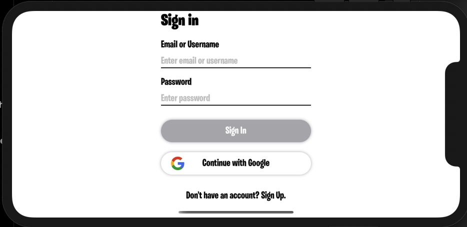
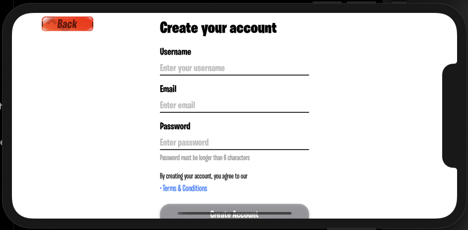
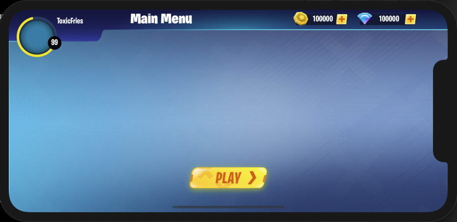

# WoopPow

## About
WoopPow is a turn based fighting iOS game in 3D. Users select one attack move and one dodge move each turn. Using SceneKit, WoopPow loads collada files for its character models and animations. 

## How to Use
1. Download project and open in Xcode
2. Go to directory that contains the Podfile
```
$ cd iOS/WoopPow
```
3. Install the project's libraries
    - If you don't have Cocoapods, install it
    ```
    $ sudo gem install cocoapods
    ```
    - If Cocoapods has finished downloading, or already downloaded, install the libraries
    ```
    $ pod install
    ```
4. Run on an Xcode's iPhone X simulator or newer devices for best experience

## Demo
### Sign in/Sign up Flow


### Main Menu

### Game View


## Tools
* Firebase
* SceneKit
* CocoaPods
    * SnapKit
    * SwiftLint
    * KeychainSwift
    * NVActivityIndicatorView
    * Kingfisher
    * Firebase
## Contributors

Contributions are welcome! Please see our [Contributing Guide](https://github.com/SamuelFolledo/WoopPow) for more details.

<table>
  <tr>
      <td align="center"><a href="https://github.com/SamuelFolledo"><br /><sub><b>Samuel P. Folledo</b></sub></a><br/></td>
        <td align="center"><a href="https://github.com/markk628"><br /><sub><b>Samuel P. Folledo</b></sub></a><br/></td>
      </tr>  
</table>

## 📝 License

By contributing, you agree that your contributions will be licensed under its MIT License.

In short, when you submit code changes, your submissions are understood to be under the same [MIT License](LICENSE) that covers the project. Feel free to contact the maintainers if that's a concern.
